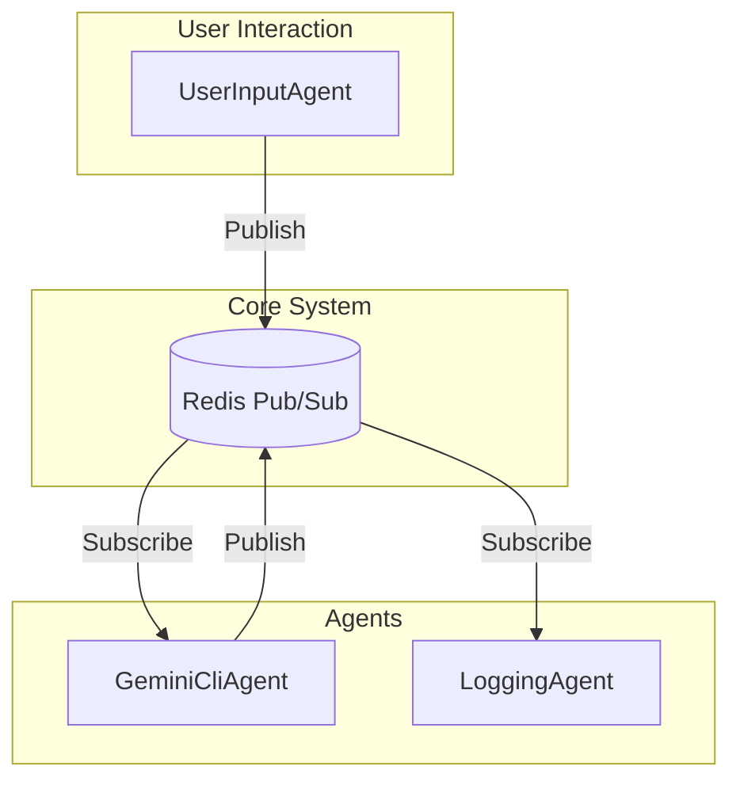

# 🤖 ai-masa - 分散マルチエージェント LLM システム

## 🌟 プロジェクト概要

`ai-masa` は、複数のLLMエージェントが協調してタスクを遂行する、分散型のマルチエージェントシステムです。通信基盤に **Redis Pub/Sub** を採用しており、各エージェントは独立したプロセスとして動作します。ユーザーからの指示は `UserInputAgent` を通じて入力され、`GeminiCliAgent` が思考と応答を担い、`LoggingAgent` が全ての通信を記録します。

## ⚙️ システムアーキテクチャ



| コンポーネント | 役割 |
| :--- | :--- |
| **UserInputAgent** | ユーザーからのコンソール入力を受け付け、システムにメッセージを送信する。 |
| **GeminiCliAgent** | メインとなる思考エージェント。Google Gemini CLIと連携し、応答を生成する。 |
| **LoggingAgent** | システム内を行き交う全てのメッセージを監視し、コンソールにログとして出力する。 |
| **Redis Pub/Sub** | 全エージェント間のメッセージングを担う非同期通信基盤。 |
| **orchestrate.sh** | `tmuxinator` を利用して、上記のエージェント群を一括で起動・管理する。 |

## 📦 セットアップ

### 1. 前提条件

- [Python 3.10+](https://www.python.org/)
- [Docker](https://www.docker.com/) と [Docker Compose](https://docs.docker.com/compose/)
- [Ruby](https://www.ruby-lang.org/en/) と [Bundler](https://bundler.io/)
- [tmux](https://github.com/tmux/tmux/wiki)
- [tmuxinator](https://github.com/tmuxinator/tmuxinator) (`gem install tmuxinator`)

### 2. 環境構築

1.  **リポジトリをクローン**
    ```bash
    git clone https://github.com/your-username/ai-masa.git
    cd ai-masa
    ```

2.  **Redisサーバーの起動**
    プロジェクトルートで以下のコマンドを実行し、RedisをDockerコンテナとして起動します。
    ```bash
    docker-compose up -d
    ```

3.  **Python依存関係のインストール**
    仮想環境を作成し、必要なライブラリをインストールします。
    ```bash
    python -m venv .venv
    source .venv/bin/activate
    pip install -r requirements.txt 
    # (もしrequirements.txtがなければ) pip install -e .
    ```

## 🚀 実行方法

`orchestrate.sh` スクリプトを実行することで、`tmuxinator` が起動し、設定に基づいた `tmux` セッション内で全てのエージェントが自動的に開始されます。

```bash
./orchestrate.sh
```

実行後、新しい `tmux` セッションがアタッチされます。各ペインでエージェントのログを確認でき、`UserInputAgent` のペインからメッセージを送信できます。

## 🧪 テスト

ユニットテストおよび統合テストを実行するには、以下のコマンドを使用します。

```bash
python -m unittest discover tests
```

## 📂 主要なファイルと役割

| ファイル/ディレクトリ | 役割 |
| :--- | :--- |
| `ai_masa/agents/` | 各エージェント（`UserInputAgent`, `GeminiCliAgent`等）の実装。 |
| `ai_masa/agents/base_agent.py` | 全エージェントの基底クラス。Redisとの接続やメッセージングの基本機能を提供。 |
| `ai_masa/comms/redis_broker.py` | Redis Pub/Subとの通信を抽象化するクラス。 |
| `ai_masa/models/message.py` | エージェント間で交換されるメッセージのデータ構造を定義。 |
| `orchestrate.sh` | `tmuxinator` を使ってエージェント群を起動するメインスクリプト。 |
| `config/templates/orchestration.yml.template` | `tmuxinator` の設定テンプレート。`orchestrate.sh` によって動的に設定が生成される。 |
| `docker-compose.yml` | Redisサーバーを起動するためのDocker Compose設定。 |
| `tests/` | プロジェクトのユニットテストおよび統合テスト。 |