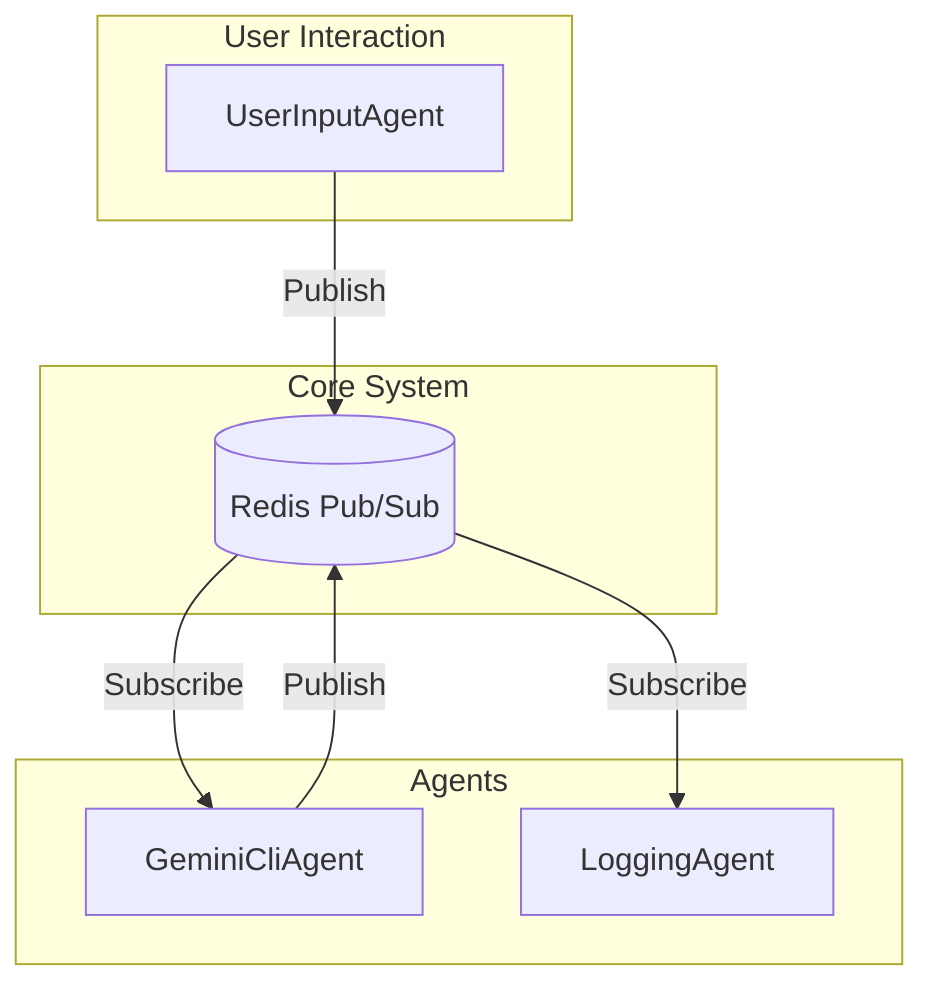

# 🤖 ai-masa - 分散マルチエージェント LLM システム

## 🌟 プロジェクト概要

`ai-masa` は、複数のLLMエージェントが協調してタスクを遂行する、分散型のマルチエージェントシステムです。通信基盤に **Redis Pub/Sub** を採用しており、各エージェントは独立したプロセスとして動作します。ユーザーからの指示は `UserInputAgent` を通じて入力され、`GeminiCliAgent` が思考と応答を担い、`LoggingAgent` が全ての通信を記録します。

## ⚙️ システムアーキテクチャ



## 📦 セットアップ

### 1. 前提条件

- [Python 3.10+](https://www.python.org/)
- [Docker](https://www.docker.com/) と [Docker Compose](https://docs.docker.com/compose/)
- [Ruby](https://www.ruby-lang.org/en/)
- [tmux](https://github.com/tmux/tmux/wiki)
- [tmuxinator](https://github.com/tmuxinator/tmuxinator) (`gem install tmuxinator`)

### 2. 環境構築

1.  **リポジトリをクローン**
    ```bash
    git clone https://github.com/your-username/ai-masa.git
    cd ai-masa
    ```

2.  **Redisサーバーの起動**
    プロジェクトルートで以下のコマンドを実行し、RedisをDockerコンテナとして起動します。
    ```bash
    docker-compose up -d
    ```

3.  **Python依存関係のインストール**
    仮想環境を作成し、必要なライブラリをインストールします。
    ```bash
    python -m venv .venv
    source .venv/bin/activate
    pip install -e .
    ```

4.  **プロジェクトルートの環境変数設定**
    `ai-masa`プロジェクトのルートディレクトリを指す環境変数 `AI_MASA_ROOT` を設定します。これにより、どのディレクトリからでもスクリプトを実行できるようになります。
    ```bash
    export AI_MASA_ROOT="$(pwd)"
    ```
    このコマンドを `~/.bashrc` や `~/.zshrc` などに追加すると、シェルを起動するたびに自動で設定されます。
    

### 3. ユーザー設定の作成

本プロジェクトでは、Gitで管理されるデフォルト設定 (`.default` ファイル) と、ユーザーが自由に編集できるローカル設定 (`.yml` ファイル) を分離しています。

初回起動前に、以下のコマンドを実行して、デフォルト設定をコピーして自分用の設定ファイルを作成してください。

```bash
cp config/agent_library.yml.default config/agent_library.yml
cp config/team_library.yml.default config/team_library.yml
cp config/orchestration.yml.default config/orchestration.yml
```

- `agent_library.yml`: 使用するエージェントの定義リストです。
- `team_library.yml`: エージェントを組み合わせてチームを定義します。
- `orchestration.yml`: どのチームを、どのtmuxinatorテンプレートで起動するかを定義します。

これらの `.yml` ファイルは `.gitignore` によりGitの追跡対象外となっているため、自由に変更・追加して自分だけのチームや起動構成を作成できます。

## 🚀 実行方法

1.  **エイリアスの設定**
    `orchestrate.sh` スクリプトを簡単に実行できるよう、エイリアスを設定することを推奨します。`~/.bashrc` や `~/.zshrc` などに以下の行を追加してください。
    ```bash
    alias masa='bash {PATH_TO_ai_masa}/orchestrate.sh'
    ```
    設定を適用するには、`source ~/.bashrc` または `source ~/.zshrc` を実行するか、新しいターミナルセッションを開始してください。

2.  **エージェントチームの起動**
    `orchestrate.sh` スクリプトは、`tmuxinator` を使って設定に基づいた `tmux` セッション内で全てのエージェントを自動的に開始します。`AI_MASA_ROOT` 環境変数を設定し、エイリアスを定義した後、以下のコマンドでチームを起動できます。

    ```bash
    # config/orchestration.yml の 'default' 設定で起動
    masa

    # '3pane' という名前の設定で起動
    masa 3pane
    ```

    実行後、新しい `tmux` セッションがアタッチされます。各ペインでエージェントのログを確認でき、`UserInputAgent` のペインからメッセージを送信できます。

## 🧪 テスト

ユニットテストおよび統合テストを実行するには、以下のコマンドを使用します。

```bash
python -m unittest discover tests
```

## 📂 主要なファイルと役割

| ファイル/ディレクトリ | 役割 |
| :--- | :--- |
| `ai_masa/agents/` | 各エージェント（`UserInputAgent`, `GeminiCliAgent`等）の実装。 |
| `config/` | エージェント、チーム、オーケストレーションの設定ファイル群。 |
| `*.yml.default` | Gitで管理されるデフォルトの設定ファイル。 |
| `*.yml` | ユーザーがカスタマイズするためのローカル設定ファイル (Git追跡対象外)。 |
| `orchestrate.sh` | `tmuxinator` を使ってエージェント群を起動するメインスクリプト。 |
| `tools/generate_tmux_config.py`| `orchestrate.sh`から呼び出され、tmuxinator設定を動的に生成する。 |
| `docker-compose.yml` | Redisサーバーを起動するためのDocker Compose設定。 |
| `tests/` | プロジェクトのユニットテストおよび統合Test。 |
